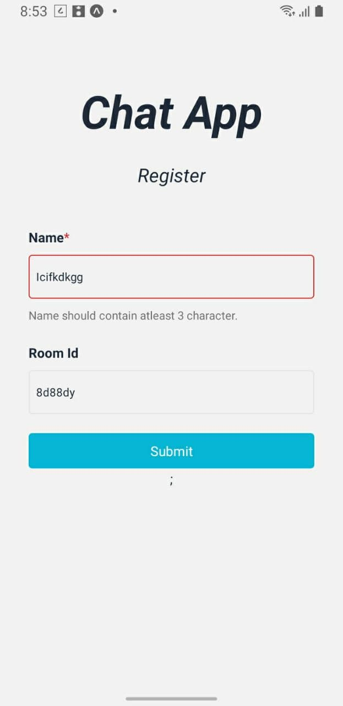
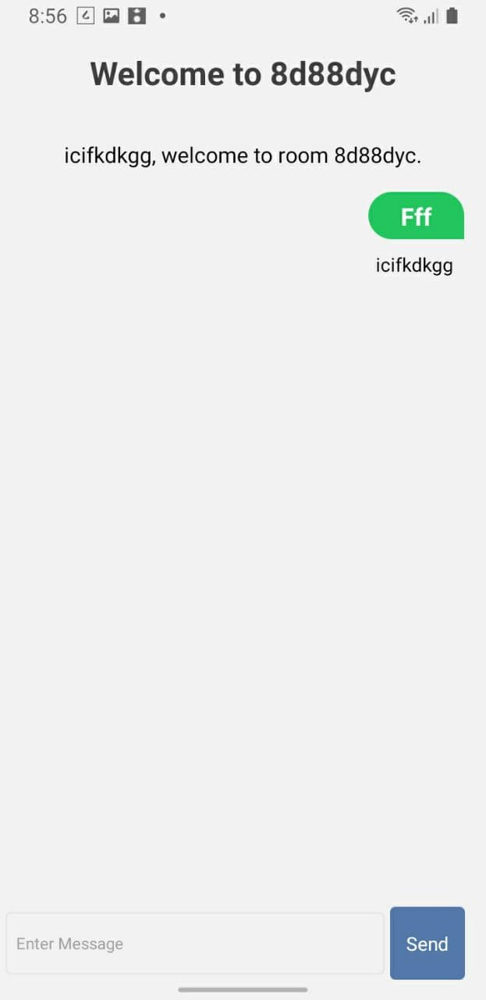

## Run locally

### Server

```bash
  cd Server 
  npm install
  npm start
```

### Application

``` bash
cd app 
yarn
yarn android
```


Used [this repo](https://github.com/craftzdog/react-native-animated-todo) as boilerplate, as native-base typescript template was not working properly.


## Library Used

**native base**, **socket-io client**

## Demo

<div style="display:flex; flex-direction:column;">
   
  
</div>

 


